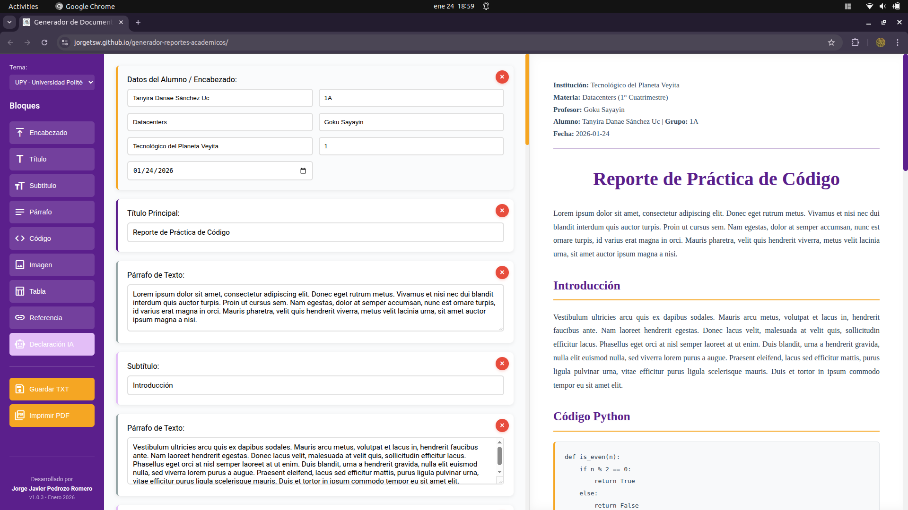
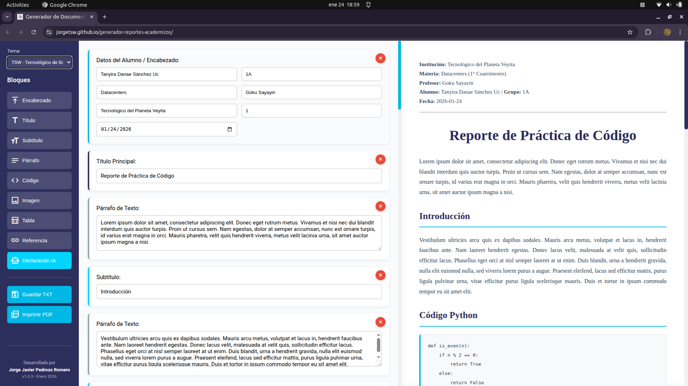
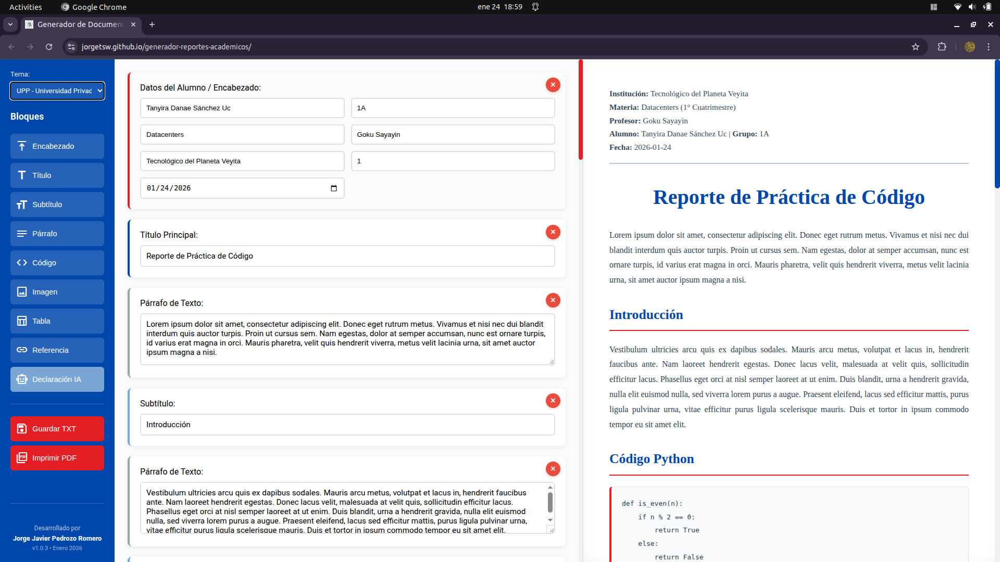
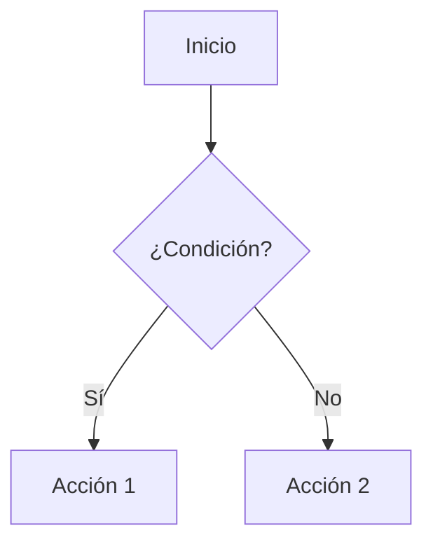

# Generador de Reportes Académicos

> Herramienta web profesional para crear reportes académicos con vista previa en tiempo real


---

## 🆕 Novedades v2.3.0

**¡Nueva versión con sistema BibTeX integrado!**

- ✅ **Sistema BibTeX Completo** - Gestión profesional de referencias
- ✅ **Citado Universal** - Usa `[clave]` para citar en cualquier texto
- ✅ **Exportar .bib** - Genera archivos compatibles con LaTeX
- ✅ **Switch IEEE/BibTeX** - Cambia entre modos sin perder datos
- ✅ **Drag & Drop** - Reordena bloques arrastrando con el mouse
- ✅ **Diseño Mejorado** - Eliminación de degradados para look más limpio
- ✅ **Diagramas Mermaid Mejorados** - Corrección de renderizado

**Versiones anteriores (v2.0.0):**
- ✅ **Listas con viñetas y enumeración**
- ✅ **Citado IEEE completo** con campos académicos
- ✅ **Autoguardado local** cada 30 segundos
- ✅ **Control de versiones** automático
- ✅ **Deshacer/Rehacer** (Ctrl+Z / Ctrl+Y)
- ✅ **Diagramas Mermaid** integrados
- ✅ **Fórmulas matemáticas** con LaTeX/KaTeX

[Ver el Changelog completo →](CHANGELOG.md) | [Guía de uso detallada →](GUIA_USO.md) | [📚 Guía BibTeX →](EXAMPLES/EJEMPLO_BIBTEX.md)

---

## Descripción

Aplicación web 100% cliente para generar documentos académicos profesionales con múltiples tipos de bloques: encabezados, títulos, párrafos, código, imágenes, **tablas**, referencias IEEE, **bibliografía BibTeX**, **listas**, **fórmulas matemáticas**, **diagramas** y **declaración de uso de IA**.

### Características Principales

- **16+ Tipos de Bloques**: Encabezado, Título, Subtítulo, Párrafo, Markdown, Listas (2 tipos), Código, Fórmulas, Diagramas, Imagen, Tabla, Referencias IEEE, **Bibliografía BibTeX**, Declaración IA
- **Sistema BibTeX**: Crea entradas @article, @book, @online, etc. y cita con `[clave]`
- **Exportar .bib**: Compatible con LaTeX, Overleaf, y gestores bibliográficos
- **Drag & Drop**: Reordena bloques arrastrando visualmente
- **3 Temas Institucionales**: TSW, UPY, UPP con paletas personalizadas
- **Sistema de Versiones**: Guarda automáticamente versiones cada 5 minutos
- **Deshacer/Rehacer**: Hasta 50 acciones reversibles
- **Autoguardado**: Persistencia automática cada 30 segundos
- **Fórmulas Matemáticas**: Renderizado profesional con KaTeX
- **Diagramas**: Integración completa de Mermaid.js
- **Citado Académico**: Formato IEEE manual o BibTeX universal
- **Tablas Profesionales**: Grid visual de 1-6 columnas con diseño académico
- **Declaración de IA**: Sistema completo para documentar uso de herramientas de IA
- **Exportación Múltiple**: PDF (impresión), TXT, JSON, y .bib
- **Seguro**: Protección XSS completa
- **Responsive**: Funciona en desktop, tablet y móvil
- **Sin Backend**: Todo en el navegador, sin servidor

---

## Demo en Vivo

**GitHub Pages:** [[https://JorgeTSW.github.io/generador-reportes-academicos/](https://notyorch.github.io/generador-reportes-academicos/)](https://notyorch.github.io/generador-reportes-academicos/)

---

## Capturas de Pantalla

### Interfaz Principal

#### Tema 1


#### Tema 2


#### Tema 3


---

## Temas Disponibles

### TSW - Tecnológico de Software
- Azul Oscuro (#2C2E5C) + Cyan (#00B8E6)
- Estilo moderno y tecnológico

### UPY - Universidad Politécnica de Yucatán
- Morado (#5B1F8C) + Oro (#F5A623)
- Elegante y distintivo

### UPP - Universidad Privada de la Península
- Azul Fuerte (#0047AB) + Rojo (#E31E24)
- Clásico y profesional

---

## Instalación

### Opción 1: Uso Directo (Sin Instalación)

1. Descarga el proyecto:
```bash
git clone https://github.com/JorgeTSW/generador-reportes-academicos.git
```

2. Abre `index.html` en tu navegador

No requiere instalación de dependencias (KaTeX y Mermaid se cargan desde CDN).

### Opción 2: GitHub Pages

Simplemente visita: [https://JorgeTSW.github.io/generador-reportes-academicos/](https://JorgeTSW.github.io/generador-reportes-academicos/)

---

## Uso Rápido

### 1. Seleccionar Tema
Usa el selector en la parte superior de la barra lateral para elegir tu institución.

### 2. Agregar Bloques
Click en los botones de la barra lateral:
- **Encabezado** - Datos del estudiante
- **Título** - Título del reporte
- **Subtítulo** - Secciones
- **Párrafo** - Texto
- **Lista con viñetas** - Listas desordenadas
- **Lista numerada** - Listas ordenadas
- **Código** - Snippets de código
- **Fórmula LaTeX** - Ecuaciones matemáticas
- **Diagrama Mermaid** - Diagramas y gráficos
- **Imagen** - Imágenes con descripción
- **Tabla** - Tablas de 1-6 columnas
- **Referencia** - Bibliografía IEEE simple
- **Cita IEEE** - Referencias académicas completas
- **Declaración IA** - Declaración de uso de IA

### 3. Editar y Gestionar
- **Deshacer** - Ctrl+Z o botón Deshacer
- **Rehacer** - Ctrl+Y o botón Rehacer
- **Ver Versiones** - Botón "Versiones" para ver historial
- **Eliminar bloques** - Botón "×" en cada bloque

### 4. Exportar
- **Imprimir PDF** - Ctrl+P o botón "Imprimir PDF"
- **Guardar TXT** - Botón "Guardar TXT"
- **Guardar manualmente** - Ctrl+S (también hay autoguardado)

---

## ⌨️ Atajos de Teclado

| Atajo | Acción |
|-------|--------|
| `Ctrl+Z` / `Cmd+Z` | Deshacer última acción |
| `Ctrl+Y` / `Cmd+Y` | Rehacer acción deshecha |
| `Ctrl+Shift+Z` / `Cmd+Shift+Z` | Rehacer (alternativo) |
| `Ctrl+S` / `Cmd+S` | Guardar manualmente |
| `Ctrl+P` / `Cmd+P` | Imprimir/Exportar a PDF |

---

## Sistema de Tablas

### Características:
- **1 a 6 columnas** configurables
- **Grid visual** tipo Excel
- **Agregar/eliminar filas** dinámicamente
- **Numeración automática** (Tabla 1, 2, 3...)
- **Descripción/caption**
- **Word-wrap** en headers y contenido
- **Estilo académico formal**

### Ejemplo:
```
Columnas: 3

┏━━━━━━━━━┳━━━━━━━━━┳━━━━━━━━━┓
┃ Header1 ┃ Header2 ┃ Header3 ┃
┣━━━━━━━━━╋━━━━━━━━━╋━━━━━━━━━┫
┃ Dato1   ┃ Dato2   ┃ Dato3   ┃
┗━━━━━━━━━┻━━━━━━━━━┻━━━━━━━━━┛

Tabla 1: Descripción de la tabla
```

---

## Declaración de IA

Sistema completo para cumplir con políticas de integridad académica.

### Opción "NO usé IA":
- Disclaimer automático
- Campo de nombre individual (para equipos)
- Compromiso documentado

### Opción "SÍ usé IA":
- Nombre del estudiante
- IA utilizada (ChatGPT, Claude, Gemini, etc.)
- Fecha de uso
- Propósito
- Prompt completo
- Archivos adjuntos
- Respuesta en crudo (raw)

---

## 📐 Fórmulas Matemáticas (LaTeX/KaTeX)

Renderizado profesional de ecuaciones matemáticas con KaTeX.

### Modos de visualización:
- **Bloque**: Fórmula centrada en su propia línea
- **En línea**: Fórmula integrada en el texto

### Ejemplos:
- Ecuación de Einstein: `E = mc^2`
- Teorema de Pitágoras: `a^2 + b^2 = c^2`
- Fracciones: `\frac{a}{b}`
- Sumatorias: `\sum_{i=1}^{n} i`
- Integrales: `\int_{0}^{\infty} e^{-x} dx`

[Ver más ejemplos en la guía de uso →](GUIA_USO.md#-fórmulas-latexkatex)

---

## 📊 Diagramas Mermaid

Creación de diagramas profesionales con Mermaid.js

### Tipos soportados:
- Diagramas de flujo
- Diagramas de secuencia
- Diagramas de Gantt
- Diagramas de clase
- Diagramas de estado
- Diagramas de entidad-relación
- Y más...

### Ejemplo básico:


[Ver más ejemplos de diagramas →](GUIA_USO.md#-diagramas-mermaid)

---

## 📚 Sistema de Citado IEEE

Dos tipos de referencias bibliográficas:

### 1. Referencia Simple (bloque "Referencia")
- Formato IEEE básico
- Para libros, artículos y páginas web
- Campos: autor, título, fuente, año, URL

### 2. Cita IEEE Completa (bloque "Cita IEEE")
- Formato IEEE académico completo
- Campos adicionales: volumen, número, páginas, DOI
- Tipos: artículos de revista, libros, conferencias, páginas web
- Formateo automático según el tipo

**Ejemplo de salida:**
```
[1] J. Smith, M. Doe, "Advanced Machine Learning," IEEE Trans. Neural Networks,
    vol. 25, no. 3, pp. 123-145, 2023, doi: 10.1109/TNNLS.2023.1234567.
```

---

## 💾 Autoguardado y Versiones

### Autoguardado
- Guardado automático cada **30 segundos**
- Indicador visual de última hora guardada
- Persistencia en localStorage
- Recuperación automática al recargar

### Control de Versiones
- Versión automática cada **5 minutos**
- Historial completo con fecha y hora
- Restauración de versiones anteriores
- Interfaz visual para explorar el historial

### Deshacer/Rehacer
- Hasta **50 acciones** reversibles
- Integración con Ctrl+Z / Ctrl+Y
- Preserva el historial completo de cambios

---

## Estructura del Proyecto

```
generador-reportes-academicos/
├── ASSETS
│   └── favicon.png
├── Contributing.md
├── CSS
│   └── style.css		# Estilos con temas
├── DOCS
├── EXAMPLES			# Carpeta con ejemplos de documentos generados
│   ├── EJEMPLO.pdf
│   └── EJEMPLO.txt
├── index.html			# Aplicación principal
├── JS
│   └── script.js		# Lógica de la aplicación
├── LICENSE
├── README.md
└── SCREENSHOTS			# Carpeta con Screenshots
    ├── S1.png
    ├── S2.png
    └── S3.png
```

---

## Tecnologías

- **HTML5** - Estructura
- **CSS3** - Estilos (Variables CSS, Grid, Flexbox)
- **JavaScript (ES6+)** - Lógica
- **KaTeX 0.16.9** - Renderizado de fórmulas matemáticas (CDN)
- **Mermaid 10** - Creación de diagramas (CDN)
- **LocalStorage** - Persistencia de datos y versiones

### Dependencias Externas (CDN)
- KaTeX para fórmulas LaTeX
- Mermaid.js para diagramas
- Google Material Symbols para iconos

### Sin Backend
- Sin frameworks pesados
- Sin npm/build process
- Sin servidor requerido
- Todo funciona en el navegador

---

## Seguridad

- Sanitización completa de inputs con `escapeHtml()`
- Protección de atributos con `escapeAttr()`
- Prevención de XSS (Cross-Site Scripting)
- Imágenes Base64 seguras

---

## Compatibilidad

### Navegadores:
- Chrome/Edge 90+

### Dispositivos:
- Desktop (óptimo)
- Tablet
- Móvil (funcional, pero tiene bugs visuales)

---

## Casos de Uso

### Académico:
- Reportes de laboratorio
- Tareas y trabajos
- Proyectos finales
- Investigaciones

### Profesional:
- Documentación técnica
- Reportes de análisis
- Especificaciones
- Manuales

---

## Contribuir

Las contribuciones son bienvenidas.

1. Fork el proyecto
2. Crea una rama (`git checkout -b feature/nueva-funcionalidad`)
3. Commit tus cambios (`git commit -m 'feat: nueva funcionalidad'`)
4. Push a la rama (`git push origin feature/nueva-funcionalidad`)
5. Abre un Pull Request

Ver [Contributing.md](Contributing.md) para más detalles.

---

## Reportar Problemas

Si encuentras un bug o tienes una sugerencia:

1. Ve a [Issues](https://github.com/JorgeTSW/generador-reportes-academicos/issues)
2. Click en "New Issue"
3. Describe el problema o sugerencia

---

## Declaración de Uso de Inteligencia Artificial

Este proyecto fue desarrollado con asistencia de herramientas de inteligencia artificial, conforme a las siguientes especificaciones:

### Proceso de Desarrollo:

1. **Estructura Básica (Sin IA)**
   - Idea original
   - HTML base sin estilos CSS
   - Funcionalidades básicas JS del generador
   - Estructura de archivos y organización inicial

2. **Complejización de la Lógica (Claude Sonnet 4.5)**
   - Implementación del sistema de bloques
   - Lógica de exportación PDF/TXT
   - Sistema de tablas con grid visual
   - Gestión de estado y renderizado
   - Protección XSS y sanitización

3. **Personalización y Debug de CSS (Gemini 2.0 Flash)**
   - Sistema de temas institucionales
   - Estilos responsive\*
   - Optimización de tablas académicas
   - Corrección de bugs visuales
   - Ajustes de impresión

### Declaración del Autor:

**Todos los códigos generados por IA fueron exhaustivamente revisados, modificados y adaptados por el autor del proyecto.** El uso de IA fue como herramienta de asistencia en el desarrollo, manteniendo el control total sobre la arquitectura, decisiones de diseño y calidad del código final.

**Autor:** Jorge Javier Pedrozo Romero

---

## Licencia

Este proyecto está bajo la Licencia MIT. Ver [LICENSE](LICENSE) para más detalles.

---

## Autor

**Jorge Javier Pedrozo Romero**

- GitHub: [@JorgeTSW](https://github.com/JorgeTSW)
- Email: jorge.pedroza@tecdesoftware.edu.mx
- Institución: Tecnológico de Software

---

## Agradecimientos

- Inspirado en las necesidades de estudiantes de ingeniería
- Diseñado para cumplir con estándares académicos
- Creado para la comunidad educativa

---

## Estadísticas del Proyecto


---

## Roadmap

### Versión 1.1 (Próximamente)
- [ ] Más temas institucionales
- [ ] Plantillas predefinidas
- [ ] Modo oscuro

### Versión 2.0 (Futuro)
- [ ] Editor colaborativo
- [ ] Cargar archivos
- [ ] Integración con Google Drive

---

## Si te Gusta este Proyecto

Dale una estrella en GitHub para apoyar el desarrollo.

**Compártelo con tus compañeros.**

---

<div align="center">

**Hecho por Jorge Pedrozo**

[Volver arriba](#generador-de-reportes-académicos)

</div>
# generador-reportes-acad-micos
